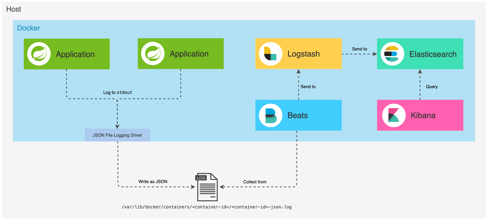
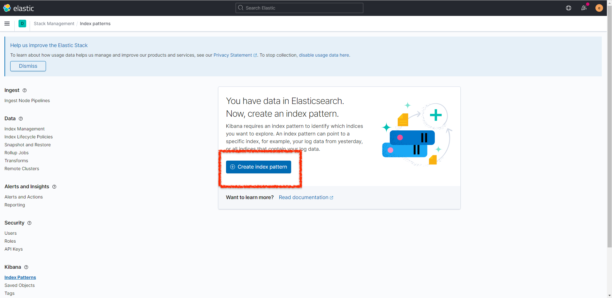
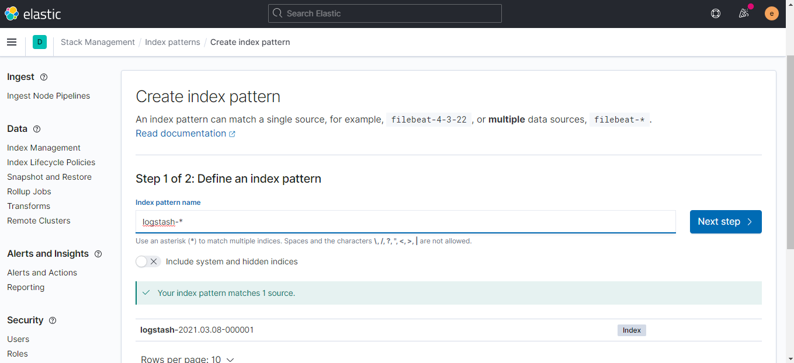
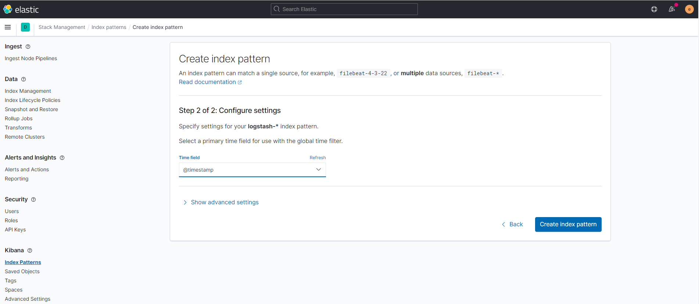

# README #

Kibana installation and all micro-services (spring-boot) 

There are multiple folders (dev, test... ) in order to split environment .
You can see the differences between localhost and an environment "not dev"

### What is this repository for? ###

* Kibana
* Logstash
* Beat
* Elasticsearch



### before running
1. open `docker-compose.yml`
2. change all **yourip** and **yourdomain** by your ip address or example.com into `docker-compose.yml`
3. setup as well the `.env` for kibana usage
4. setup kafka credential into `kafka_server_jaas.conf` file
  
you can change the port for kafka or kibana 

### How do I get set up and run? ###
Get the environment you want (test)
1. clone the repository
2. cd env_example
3. execute  
`
docker-compose up -d
`  
check kibana after a few minutes (username and pwd are in .env) :  
  http://localhost:5601
  
4. create an index 
   
5. Fill in "logstash-*" and click Next step
   
6. Choose @timestamp and create index pattern
   
7. Go to "Discover" and you can see your logs

#### Prod
1. *ulegalize-lawfirm* needs more environments: 

```
       - "app.datasource.url=jdbc:mysql://mysqlip:mysqlport/db"  
       - "app.datasource.username=mysql-user"  
       - "app.datasource.password=mysql-pwd"
       - "app.stripe.key=sk_live_...."
       - "app.slack.sensitive.webhook=https://hooks.slack.com/services/..."
       - "app.slack.newArrival.webhook=https://hooks.slack.com/services/..."
       - "app.stripe.webhookSecret=whsec_..."
       - "app.v1.slack.webhook=https://hooks.slack.com/services/..."
       - "app.cors.origin=https://yourdomain:7893,https://yourdomain"
```

### Utils commands ###
if you want to :  
delete containers
`
docker-compose down
`
check containers 
`
docker-compose ps
`
check stats (memory, cpu...) 
`
docker stats
`
  
you can delete images before
`
docker rmi $(docker images | grep 'finauxa/ulegalize')
`
```
docker stop debian_kafka_1
docker rm debian_kafka_1
docker stop debian_zookeeper_1
docker rm debian_zookeeper_1
```
### Contribution guidelines ###

* Writing tests
* Code review
* Other guidelines